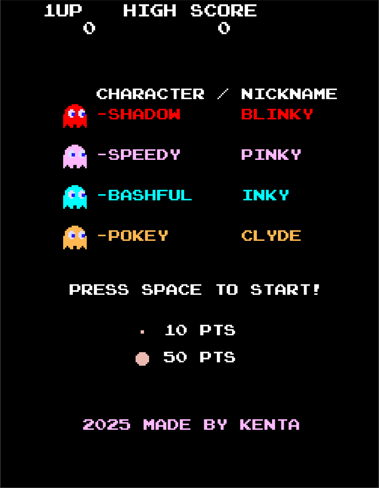
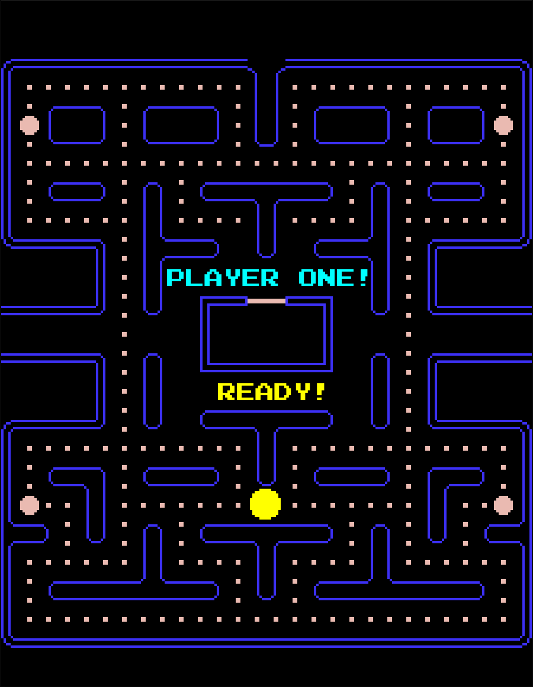
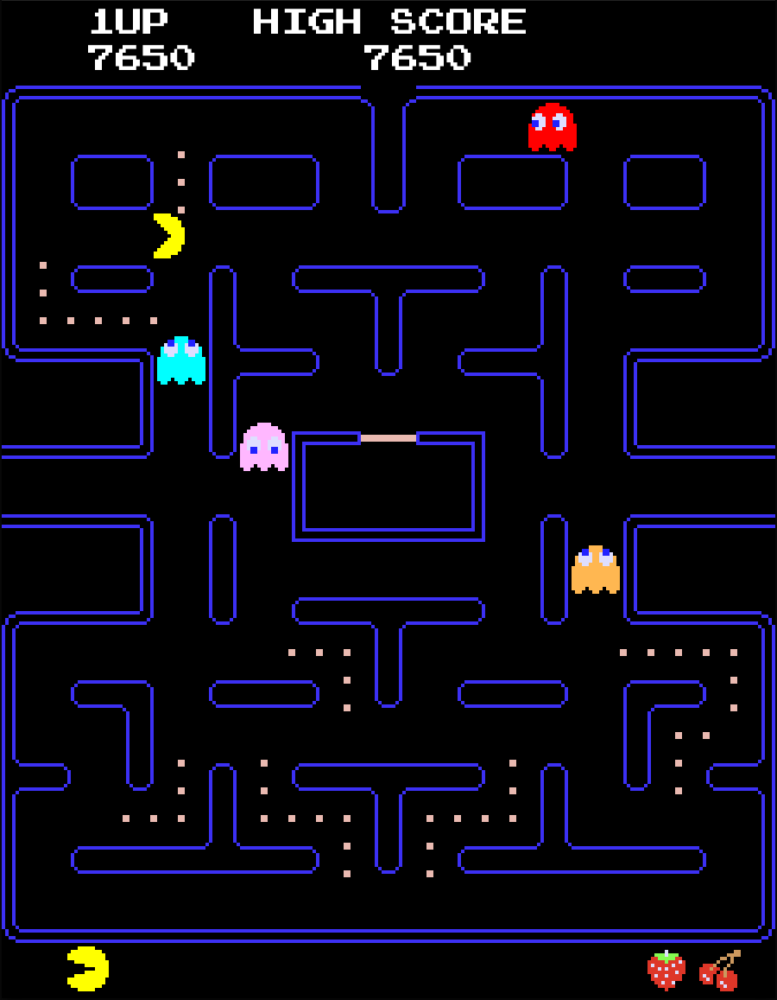

# PacMan Arcade Recreation in C3
This project is a **partial recreation of the classic PacMan arcade game**, written in the [C3 programming language](https://c3-lang.org/) and using [Raylib](https://www.raylib.com/) as a graphic API. While it has all core mechanics **some features are currently missing or incomplete**
## Screenshots
<p align="center">
  
  
  
</p>

---
## Requirements
- Linux or Windows OS
- C3 compiler (c3c)
## Instalation
All the necessary steps in order to download the C3 compiler can be found on the official website [Install C3 Compiler](https://c3-lang.org/getting-started/prebuilt-binaries/)
## Compiling a program
1. Open a terminal and navigate to the PacMan
```bash
cd PacMan
```
2. Run the following commands to build the program:
```bash
c3c build
c3c run
```
## How to play
- Start the game by pressing **space bar**
- Move using **WASD**
- Collect all **244 dots** to advance to the next level
- The game ends when **PacMan loses all his lives**
## Missing features
- Blinky lacking the **'Elroy'** mechanic
- Frighten ghost **blink** continuously instead of only when the timer is almost over
- **Random number generator** is not fully accurate to the original
## License
This project is licensed under the [MIT License](LICENSE.md)
## Acknowledgments
+ [The Pacman Dossier](https://pacman.holenet.info/#LvlSpecs)
+ [Pacman Textures](https://www.spriters-resource.com/arcade/pacman/)
+ [Why do Pinky and Inky have different behaviors when Pac-Man is facing up?](http://donhodges.com/pacman_pinky_explanation.htm)
