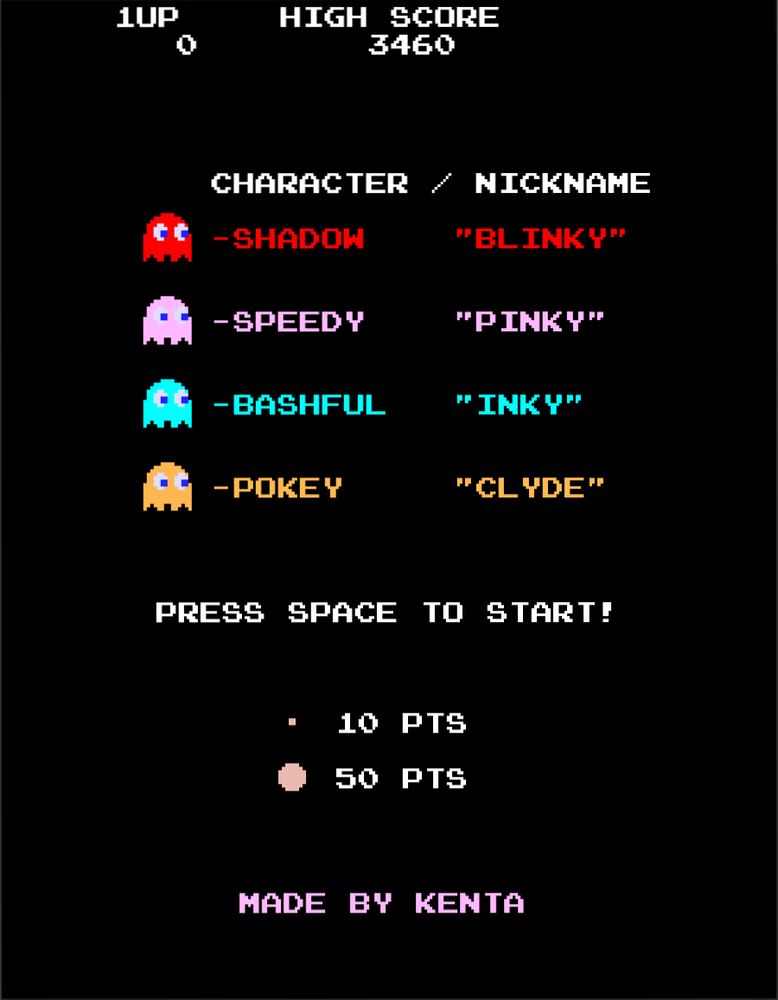
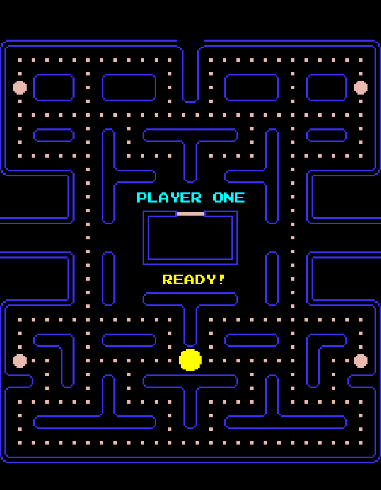
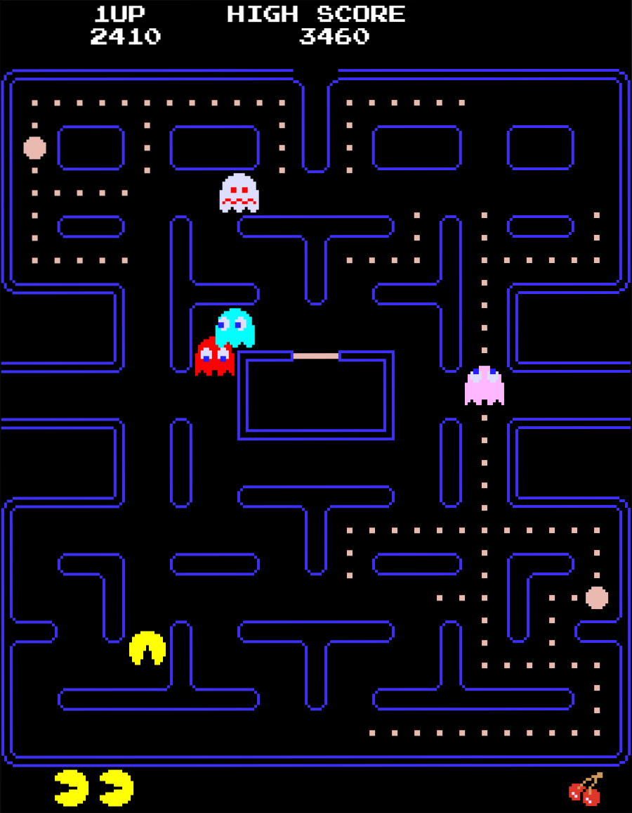

# PacMan Arcade Recreation in C3
This project is a **partial recreation of the classic PacMan arcade game**, written in the [C3 programming language](https://c3-lang.org/) and using [Raylib](https://www.raylib.com/) as a graphic API. While it has all core mechanics **some features are currently missing or incomplete**
## Screenshots
<p align="center">
  
  
  
</p>

---
## Requirements
- Linux or Windows OS
- C3 compiler (c3c)
## Instalation
All the necessary steps in order to download the C3 compiler can be found on the official website: [Install C3 Compiler](https://c3-lang.org/getting-started/prebuilt-binaries/)
## Compiling a program
1. Open a terminal and navigate to the PacMan
```bash
cd PacMan
```
2. Run the following commands to build the program:
```bash
c3c build
c3c run
```
3. If the window is too big or too small for you, navigate to the subdirectory and open a file called main.c3. There you will find a variable called screen scale, which you can change to your personal preference:
```bash
# Your prefered scale value, e.g. 4
const SCREEN_SCALE = 4;
```
## How to play
- Start the game by pressing **space bar**
- Move using **WASD**
- Collect all **244 dots** to advance to the next level
- The game ends when **PacMan loses all his lives**
- Press the **left arrow key** to **decrease** the volume and the **right arrow key** to **increase** it
## Missing features
- Frighten ghost **blink** continuously instead of only when the timer is almost over
- **Pac-Ma**n becomes **unresponsive (can’t turn or react)** after a **ghost dies**
- **Ghost music** lacking proper **update functionality**
## License
This project is licensed under the [MIT License](LICENSE.md)
## Acknowledgments
+ [The Pacman Dossier](https://pacman.holenet.info/#LvlSpecs)
+ [Why do Pinky and Inky have different behaviors when Pac-Man is facing up?](http://donhodges.com/pacman_pinky_explanation.htm)
+ [How frightened ghosts decide where to go](https://www.youtube.com/watch?v=eFP0_rkjwlY&t=409s)
+ [Pacman Textures](https://www.spriters-resource.com/arcade/pacman/)
+ [Pacman sound effects](https://downloads.khinsider.com/game-soundtracks/album/pac-man-game-sound-effect-original-soundtrack-2024)
